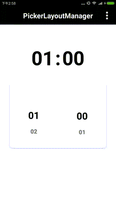
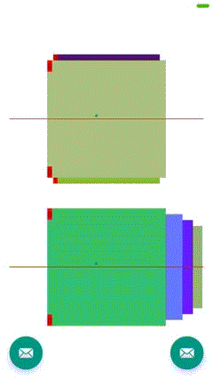

[](https://jitpack.io/#ashLikun/XLayoutManager)

XLayoutManager项目简介
    自定义LayoutManage
## 使用方法

build.gradle文件中添加:
```gradle
allprojects {
    repositories {
        maven { url "https://jitpack.io" }
    }
}
```
并且:

```gradle
dependencies {
    implementation 'com.github.ashLikun:XLayoutManager:{latest version}'
}
```

## 详细介绍
用法与普通的LayoutManage 相差无几


## 效果图
| EchelonLayoutManager | PickerLayoutManager | SlideLayoutManager |
| :----: | :---:| :---:|
| |   | |

| SkidRightLayoutManager | ViewPagerLayoutManager | FrameLayouManage |
| :---:| :---:|:---:|
| |   | |